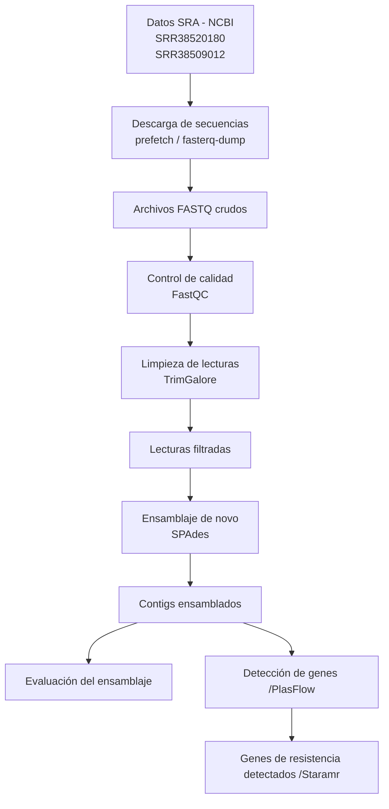

# MBM_G1  
# Proyecto: Identificación de genes de resistencia antimicriobiana de aislados clínicos de *Pseudomonas aeruginosa*    
## Integrantes  
- José Proaño  
- Génesis Morocho  
- Mayra Erazo 
- Samanta Bucheli  
- Michelle Yugcha
## Pregunta de investigación
¿Qué genes de resistencia antimicrobiana pueden identificarse mediante el ensamblaje y análisis bioinformático de diferentes aislados clínicos de *Pseudomonas aeruginosa*? 
  
## Objetivos  
### Objetivo general  
Identificar genes de resistencia antimicrobiana y secuencias plasmídicas presentes en diferentes aislados clínicos de *Pseudomonas aeruginosa* mediante ensamblaje de novo y análisis bioinformático.
### Objetivos específicos
•  Realizar el control de calidad de las lecturas genómicas obtenidas de diferentes aislados clínicos de *Pseudomonas aeruginosa*.   
•  Ensamblar los genomas bacterianos utilizando herramientas de ensamblaje de novo.   
•  Detectar genes de resistencia antimicrobiana utilizando bases de datos específicas.    
•  Comparar los perfiles de resistencia antimicrobiana entre los diferentes aislados clínicos analizados.  
## Dataset  
Las secuencias fueron obtenidas desde la base de datos pública Sequence Read Archive (SRA) del National Center for Biotechnology Information (NCBI), la cual almacena datasets de secuenciación genómica generados en investigaciones científicas.  
Se utilizarán secuencias genómicas en formato FASTQ de dos diferentes aislados clínicos de *Pseudomonas aeruginosa* provenientes de secuenciación de lecturas largas mediante tecnología illumina, este tipo de datos permite trabajar con lecturas reales o en crudo de secuenciación genómica.   
Las secuencias de trabajo fueron las siguientes:     
1.	*Pseudomonas aeruginosa*: Illumina sequencing of 2026CB-00371 (SRR38520180)    
Tamaño: 490.6 Mb   
Contenido de GC: 65.8%   
Fecha de publicación: 12-05-2026   
Procedencia: Texas Department of State Health Services, Estados Unidos      
  
2.	*Pseudomonas aeruginosa* genomic sequencing of bacterial isolate 2026CH_00024 (SRR38509012)  
Tamaño: 332.9 Mb   
Contenido de GC: 66%   
Fecha de publicación: 11-05-2026   
Procedencia: Wyoming Public Health Laboratory, Estados Unidos  

 ## Metodología 

### Herramientas bioinformáticas empleadas

1. SRA: descarga de secuencias crudas a partir de CNBI.

2. FastQC: revisión de calidad de lecturas

3. Trim Galore: permite la limpieza de los datos crudos

4. SPAdes: formación de conting

5. Busco: calidad del ensamble

6. PlastFlow: Predicción de ADN plasmídico o cromosómico  

7. Staramr: Buscar genes de resistencia antimicrobiana  

### Flujo de trabajo

El workflow bioinformático inició con la descarga de secuencias genómicas desde la base de datos SRA del NCBI correspondientes a los aislados clínicos SRR38520180 y SRR38509012.  

Posteriormente, se realizó el control de calidad de las lecturas utilizando FastQC y la limpieza de adaptadores y lecturas de baja calidad mediante TrimGalore.  

Las lecturas filtradas fueron ensambladas de novo con SPAdes para obtener contigs genómicos.

Finalmente, se diferenció el ADN Plasmídico y genómico con PlasFlow y se identificaron genes de resistencia antimicrobiana con Staramr.

Diagrama 1. FLujo de trabajo bioinformático

## Resultados  

En la primera secuencia de *Pseudomonas aeruginosa* se observa que la detección de los genes aph, blaOXA, blaPAO, catB7 y fosA evidencia un perfil de multirresistencia frente a familias de antibióticos de importancia clínica. Destaca especialmente la resistencia a ceftazidima y cefepima, fármacos de última línea empleados habitualmente en el tratamiento de infecciones graves causadas por este patógeno.

En la segunda secuencia se identificó el gen aph(3')-IIb, el cual confiere resistencia a los aminoglucósidos, así como un conjunto de enzimas beta-lactamasas capaces de hidrolizar el anillo químico de la penicilina. Debido a esto, y a su resistencia demostrada a meropenem y ceftacidima, se clasificó a este aislamiento como una cepa multirresistente.

## Conclusiones

Para concluir la importancia de identificar genes de resistencia antimicrobiana en *Pseudomonas aeruginosa* se ha evidenciado en brotes hospitalarios reales, por lo que la caracterización molecular es esencial para la vigilancia epidemiológica, el diagnóstico oportuno y la toma de decisiones terapéuticas eficaces frente a bacterias multirresistentes.

El uso de diferentes plataformas bioinformáticas nos permitió realizar un análisis mucho mas completo, organizado y confiable en lo que respecta a la identificación de genes de resistencia antimicrobiana en *Pseudomonas aeruginosa*.

La base de datos NCBI y el repositorio SRA ayudaron con el acceso a información genómica de alta calidad. Por otro lado, la plataforma Galaxy y la computadora virtual con Ubuntu ofrecieron un espacio accesible, donde poder manejar archivos extensos para ejecutar análisis sin necesidad de infraestructura especializada.

Las herramientas como FASTQC y Trim Galore permiten evaluar y depurar la calidad de los datos, mientras que SPAdes facilitó el ensamblaje genómico y Staramr permitió detectar genes de resistencia de manera rápida y precisa.

En conjunto, estas plataformas optimizan el tiempo de análisis, nos ayudaron a reducir errores y fortalecen la vigilancia epidemiológica, aportando información clave para el diagnóstico y la toma de decisiones terapéuticas frente a cepas multirresistentes.

Los genes de resistencia antimicrobiana identificados en los aislados de *Pseudomonas aeruginosa* se asociaron principalmente a ADN cromosómico y no plasmídico, lo que sugiere mecanismos de resistencia intrínseca o adaptativa propios de la bacteria. Además, las herramientas bioinformáticas utilizadas permitieron identificar eficientemente genes de resistencia y secuencias plasmídicas potenciales.

## Contribución individual  

Génesis Morocho: Creación del repositorio de github y añadir a los coolaboradores. Diseño del flujo de trabajo, investigación e interpretación de los genes de resistencia en plásmidos.  
Jose Proaño: desarrollo de lineas de comando para el ensamblaje y calidad de secuencias.
Michelle Yugcha: Búsqueda se secuencias de trabajo y desarrollo del análisis en la plataforma Galaxy.  

## Cómo reproducir (scripts)
Dentro de la carpeta data, processed, se puede encontrar el script que se uso en Ubuntu.   

## Tutorial de Galaxy
Willem de Koning, Saskia Hiltemann, Detección de resistencia a antibióticos (Materiales de capacitación de Galaxy) . https://training.galaxyproject.org/training-material/topics/microbiome/tutorials/plasmid-metagenomics-nanopore/tutorial.html En línea; consultado el miércoles 13 de mayo de 2026.
