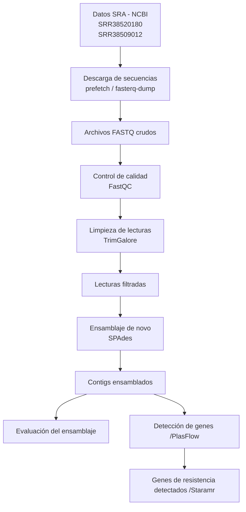

# INFORME DEL PROYECTO FINAL DE HERRAMIENTAS ÓMICAS I
## INTEGRANTES 
José Proaño  
Génesis Morocho  
Mayra Erazo  
Samanta Bucheli  
Michelle Yugcha  
## TEMA 
# Identificación de genes de resistencia antimicriobiana de aislados clínicos de *Pseudomonas aeruginosa*

## INTRODUCCIÓN
La resistencia antimicrobiana (RAM) es considerada una de las principales amenazas para la salud pública mundial debido al aumento de bacterias multirresistentes que disminuyen la eficacia de los tratamientos antibióticos. *Pseudomonas aeruginosa* es un patógeno oportunista asociado principalmente a infecciones hospitalarias y posee una elevada capacidad para desarrollar resistencia mediante bombas de eflujo, mutaciones cromosómicas y adquisición de genes de resistencia a través de plásmidos y otros elementos móviles (Pang et al., 2019). Además, esta bacteria ha sido catalogada por la Organización Mundial de la Salud como un patógeno prioritario crítico para el desarrollo de nuevos antibióticos (WHO, 2024).  

En este proyecto se busca identificar genes de resistencia antimicrobiana presentes en aislados clínicos de *Pseudomonas aeruginosa* mediante el uso de herramientas ómicas. 

## PREGUNTA DE INVESTIGACIÓN
¿Qué genes de resistencia antimicrobiana pueden identificarse mediante el ensamblaje y análisis bioinformático de diferentes aislados clínicos de *Pseudomonas aeruginosa*?   

## OBJETIVOS
Objetivo general:  
Identificar genes de resistencia antimicrobiana y secuencias plasmídicas presentes en diferentes aislados clínicos de *Pseudomonas aeruginosa* mediante ensamblaje de novo y análisis bioinformático.

Objetivos específicos:  
• Realizar el control de calidad de las lectura s genómicas obtenidas de diferentes aislados clínicos de *Pseudomonas aeruginosa*.  
• Ensamblar los genomas bacterianos utilizando herramientas de ensamblaje de novo.    
• Detectar genes de resistencia antimicrobiana utilizando bases de datos específicas.  
• Comparar los perfiles de resistencia antimicrobiana entre los diferentes aislados clínicos analizados.  

## DESARROLLO Y RESULTADOS

## Herramientas empleadas
SRA: descarga de secuencias crudas a partir de CNBI.

FastQC: revisión de calidad de lecturas

Trim Galore: permite la limpieza de los datos crudos

SPAdes: formación de conting

PlastFlow: predicción de ADN plasmídico o cromosómico

Staramr: buscar genes de resistencia antimicrobiana

WORKFLOW
El workflow bioinformático inició con la descarga de secuencias genómicas desde la base de datos SRA del NCBI correspondientes a los aislados clínicos SRR38520180 y SRR38509012.  

Posteriormente, se realizó el control de calidad de las lecturas utilizando FastQC y la limpieza de adaptadores y lecturas de baja calidad mediante TrimGalore.  

Las lecturas filtradas fueron ensambladas de novo con SPAdes para obtener contigs genómicos.

Finalmente, se diferenció el ADN Plasmídico y genómico con Pastflow y se identificaron genes de resistencia antimicrobiana con Staramr.

El workflow bioinformático inició con la descarga de secuencias genómicas desde la base de datos SRA del NCBI correspondientes a los aislados clínicos SRR38520180 y SRR38509012.  

Posteriormente, se realizó el control de calidad de las lecturas utilizando FastQC y la limpieza de adaptadores y lecturas de baja calidad mediante TrimGalore.  

Las lecturas filtradas fueron ensambladas de novo con SPAdes para obtener contigs genómicos.

Finalmente, se diferenció el ADN Plasmídico y genómico con PlasFlow y se identificaron genes de resistencia antimicrobiana con Staramr.

Diagrama 1. FLujo de trabajo bioinformático

### Obtención y preparación de datos 

Se realizó una búsqueda en la base de datos pública Sequence Read Archive (SRA) del National Center for Biotechnology Information (NCBI), donde se utilizó la terminología “*Pseudomonas aeruginosa* clinical isolate illumina”, como se muestra en la Figura 1.   

Figura 1. Búsqueda de “Pseudomonas aeruginosa clinical isolate Illumina” en NCBI. 

La selección de las secuencias de trabajo se realizó considerando que los aislados clínicos fueran de diferente procedencia, de lo cual resultaron dos genomas de *Pseudomonas aeruginosa*, identificadas como: SRR38509012; SRR38520180, como se muestra en las Figura 2 y Figura3.

Figura 2. Detalle de la búsqueda de la secuencia SRR38509012  

Figura 3. Detalle de la búsqueda de la secuencia SRR38520180  
  

### PROCESAMIENTO DE INFORMACIÓN GENÓMICA EN UBUNTU

El proceso de descarga se lo realizo utilizando el comando prefetch como se lo vizualiza en la Figura 4.  
Se utilizo este comando ya que nos ayuda a tener una descarga mas eficiente y mas rapida en relacion a la que nos da NCBI.  

Figura 4. Utilización del comando prefetch  
 

Posterior a ello se lo convirtio en formato fastq con el comando fasterq-dump SRR38520180 --split-files

Figura 5. Utilización de comando fasterq-dump    

  

  

### Control de calidad de datos  
Para el control de calidad se utilizo el comando fastqc *.fastq -t 8 con el cual nos ayuda a correr todos los archivos en conjunto  
Figura 6. Aplicación de comando fastqc -t 8

### Limpieza de lecturas
Para la limpieza y eliminacion de adaptadores se utilizo tringalore con el codigo trim_galore --paired --phred33 --cores 4 --quality 30 --length 30 --gzip --output_dir TrimmedReads -a 
"file:./my_adapters.fa" -a2 "file:./my_adapters.fa" /home/usuario/Escritorio/PF/SRR38520180_1.fastq /home/usuario/Escritorio/PF/SRR38520180_2.fastq  

Figura 7. Uso de la herramienta trimgalore para limpieza de lecturas  
  

Figura 8. Uso de la herramienta trimgalore para limpieza de lecturas

### Ensamblaje de novo   
Para el ensable de los datos obtenidos se utilizo Spades: spades.py -1 TrimmedReads/SRR38509012_1_val_1.fq.gz -2 TrimmedReads/SRR38509012_2_val_2.fq.gz -o Output_Spades/SRR38509012 -t 8 -m 15

Figura 9. Ensamblaje de novo con herramienta spades  

  

    

Donde vamos a tener los sguientes archivos    

Figura 10. Resultado del uso de la herramienta spades    
  

## PROCESAMIENTO DE INFORMACIÓN GENÓMICA EN LA PLATAFORMA GALAXY

Los datos genómicos descargados que contiene los contigs en formato FASTA fueron almacenados en zenodo: https://doi.org/10.5281/zenodo.20171964.   

El análisis de la resistencia antimicrobiana se realizó utilizando la plataforma Galaxy, y se hizo uso del tutorial "Antibiotic resistance detection" (Figura 11) que se encuentra en el siguiente enlace: https://training.galaxyproject.org/training-material/topics/microbiome/tutorials/plasmid-metagenomics-nanopore/tutorial.html.   

Figura 11. Tutorial de Galaxy utilizado "Antibiotic resistance detection"

Además, se creó un History denominado "Genes de resistencia en aislados de Pseudomonas aeruginosa" con el link de acceso: https://galaxy-main.usegalaxy.org/u/michelle_yugcha/h/genes-de-resistencia-en-aislados-de-pseudomonas-aeruginosa, donde se cargaron las secuencias ensambladas resultantes del procesamiento en la máquina virtual. 

Figura 12. History denominado "Genes de resistencia en aislados de Pseudomonas aeruginosa" para el procesamiento de secuencias.

### Predicción de secuencias plasmídicas y cromosómicas
Para la predicción de secuencias plasmídicas se utilizó la herramienta PlasFlow, diseñado para clasificar secuencias metagenómicas y genómicas según su origen plasmídico o cromosómico. PlasFlow funciona mediante un conjunto de scripts que emplean redes neuronales entrenadas con secuencias bacterianas conocidas, permitiendo clasificar los contigs de acuerdo con diferentes grupos taxonómicos bacterianos y estimar la probabilidad de origen plasmídico. La herramienta ha reportado una precisión aproximada del 96% en la identificación de secuencias plasmídicas en datasets genómicos y metagenómicos (Krawczyk et al., 2018).    

En este proyecto, PlasFlow permitió identificar posibles contigs plasmídicos en los aislados clínicos de *P. aeruginosa*, facilitando el análisis de elementos genéticos móviles potencialmente asociados a genes de resistencia antimicrobiana.    

Con resultado se obtuvo la clasificación de los contigs de forma tabulada de la secuencia SRR38509012 (Figura 13) y de la secuencia SRR38520180 (Figura 14). De la secuencia SRR38509012 que contenía 97 contigs, estos se clasificaron principalmente, 46 contigs como parte de ADN cromosómico de proteobacterias  y 18 contigs de ADN plasmídico de proteobacterias, como se muestra en la Figura 15. De igual forma,  se da en la secuencia SRR38520180 que presenta 146 contigs distribuidos principalmente como 73 contigs de ADN cromosómico de proteobacterias  y 26 contigs de ADN plasmídico de proteobacterias (Figura 16). Además, en ambas secuencias es predominante en tamaño de pares de bases el ADN cromosómico.   

Figura 13. Tabla de clasificación de contigs de la secuencia SRR38509012 usando PlasFlow.   

Figura 14. Tabla de clasificación de contigs de la secuencia SRR38520180 usando PlasFlow. 

Figura 15. Distribución de contigs de la secuencia SRR38509012 usando PlasFlow.

Figura 16. Distribución  de contigs de la secuencia SRR38520180 usando PlasFlow.

### Análisis de resistencia antimicrobiana  

Figura 17. Resumen de resultados del análisis genómico de la secuencia  SRR38509012 de P. aeruginosa.

Nota: En la primera secuencia se observa que la detección de los genes aph, blaOXA, blaPAO, catB7 y fosA evidencia un perfil de multirresistencia frente a familias de antibióticos de importancia clínica. Destaca especialmente la resistencia a ceftazidima y cefepima, fármacos de última línea empleados habitualmente en el tratamiento de infecciones graves causadas por este patógeno.

Figura 18. Resumen de resultados del análisis genómico de la secuencia  SRR38520180   de P. aeruginosa.

Nota: En la segunda secuencia se identificó el gen aph(3')-IIb, el cual confiere resistencia a los aminoglucósidos, así como un conjunto de enzimas beta-lactamasas capaces de hidrolizar el anillo químico de la penicilina. Debido a esto, ya su resistencia demostrada a meropenem y ceftacidima, se clasificó a este aislamiento como una cepa multirresistente.  

Finalmente en el ADN plasmídico no se detectaron genes de resistencia como se observa en la Figura 19, lo que se puede atribuir a que el microorganismo reserva sus genes de resistencia en el ADN cromosómico.

Figura 19. Resultados de genes de resistencia en ADN plasmídico

## INTERPRETACIÓN BIOLÓGICA 

El análisis bioinformático realizado en los aislados clínicos de *Pseudomonas aeruginosa* permitió identificar genes de resistencia antimicrobiana asociados principalmente a contigs clasificados como ADN cromosómico, mientras que no se detectaron genes de resistencia en secuencias plasmídicas predichas mediante la herramienta PlasFlow.  

Estos resultados sugieren que los mecanismos de resistencia presentes en los aislados estudiados (SRR38509012 y SRR38520180) podrían formar parte del genoma cromosómico estable de la bacteria y no depender de elementos genéticos móviles plasmídicos. Esto es consistente con lo que se conoce de la biología de *Pseudomonas aeruginosa*, una especie reconocida por presentar múltiples mecanismos de resistencia intrínseca, incluyendo bombas de eflujo, disminución de permeabilidad de membrana y genes asociados a resistencia adaptativa (Pang et al., 2019).  

Diversos estudios han demostrado que *Pseudomonas aeruginosa* posee una elevada capacidad de resistencia mediada por sistemas cromosómicos, los cuales contribuyen significativamente a su supervivencia frente a múltiples antibióticos y a su importancia clínica en infecciones hospitalarias (Lister et al., 2009). Aunque los plásmidos representan una vía importante de transferencia horizontal de genes de resistencia en bacterias, la ausencia de estos en contigs plasmídicos en este análisis podría indicar que los aislados estudiados presentan principalmente mecanismos de resistencia intrínseca o cromosómicamente integrados.  

## APLICACIONES

En un estudio realizado en Colombia se identificaron 139 pacientes con infección por *Pseudomonas aeruginosa*, de los cuales 54 presentaron cepas multirresistentes (resistentes a tres o más grupos de antibióticos) y 85 aislamientos sensibles a un máximo de dos grupos antimicrobianos. Estos hallazgos evidencian la elevada prevalencia de resistencia bacteriana en entornos hospitalarios y su impacto en la complejidad terapéutica.

De manera complementaria, otro estudio reportó la presencia de cepas portadoras de los genes blaKPC-2 y blaVIM-2 en pacientes hospitalizados, genes asociados a mecanismos de resistencia a carbapenémicos. Este hallazgo resalta el alto riesgo clínico que representan estas bacterias multirresistentes, debido a la limitada disponibilidad de opciones terapéuticas eficaces y al potencial incremento en la morbimortalidad hospitalaria.

## CONCLUSIONES   

El uso de diferentes plataformas bioinformáticas nos permitió realizar un análisis mucho mas completo, organizado y confiable en lo que respecta a la identificación de genes de resistencia antimicrobiana en Pseudomonas aeruginosa.

La base de datos NCBI y el repositorio SRA ayudaron con el acceso a información genómica de alta calidad. Por otro lado, la plataforma Galaxy y la computadora virtual con Ubuntu ofrecieron un espacio accesible, donde poder manejar archivos extensos para ejecutar análisis sin necesidad de infraestructura especializada. 

Las herramientas como FASTQC y Trim Galore permiten evaluar y depurar la calidad de los datos, mientras que SPAdes facilitó el ensamblaje genómico y Staramr permitió detectar genes de resistencia de manera rápida y precisa.

En conjunto, estas plataformas optimizan el tiempo de análisis, nos ayudaron a reducir errores y fortalecen la vigilancia epidemiológica, aportando información clave para el diagnóstico y la toma de decisiones terapéuticas frente a cepas multirresistentes.

## BIBLIOGRAFÍA
Pang, Z., Raudonis, R., Glick, B. R., Lin, T. J., & Cheng, Z. (2019). Antibiotic resistance in *Pseudomonas aeruginosa*: Mechanisms and alternative therapeutic strategies. Biotechnology Advances, 37(1), 177–192. https://doi.org/10.1016/j.biotechadv.2018.11.013   

World Health Organization. (2024). Antimicrobial resistance. WHO – Antimicrobial resistance
Pacheco T, Bustos-Cruz RH, Abril D, Arias S, Uribe L, Rincón J, García JC, Escobar-Perez J. Pseudomonas aeruginosa Coharboring BlaKPC-2 and BlaVIM-2 Carbapenemase Genes. Antibiotics (Basel). 2019 Jul 20;8(3):98. doi: 10.3390/antibiotics8030098. PMID: 31330771; PMCID: PMC6784026. https://pmc.ncbi.nlm.nih.gov/articles/PMC6784026/pdf/antibiotics-08-00098.pdf

Cuesta, D., Vallejo, M., Guerra, K., Cárdenas, J., Hoyos, C., Loaiza, E., & Villegas, M. V. (2012). Infección intrahospitalaria por Pseudomonas aeruginosa multirresistente: Estudio de casos y controles. Medicina U.P.B., 31(2), 135–142. file:///C:/Users/Samanta/Downloads/ezapatarestrepo,+Art%C3%ADculo+original+5.pdf  

Krawczyk, P. S., Lipinski, L., & Dziembowski, A. (2018). PlasFlow: Predicting plasmid sequences in metagenomic data using genome signatures. Nucleic Acids Research, 46(6), e35. https://doi.org/10.1093/nar/gkx1321

Lister, P. D., Wolter, D. J., & Hanson, N. D. (2009). Antibacterial-resistant Pseudomonas aeruginosa: Clinical impact and complex regulation of chromosomally encoded resistance mechanisms. Clinical Microbiology Reviews, 22(4), 582–610. https://doi.org/10.1128/CMR.00040-09
